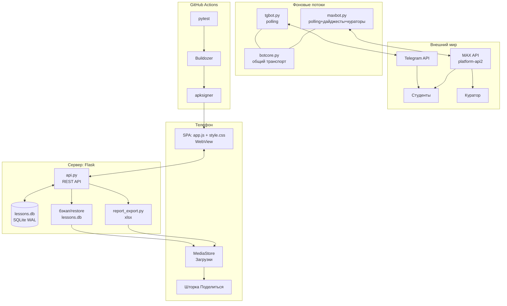
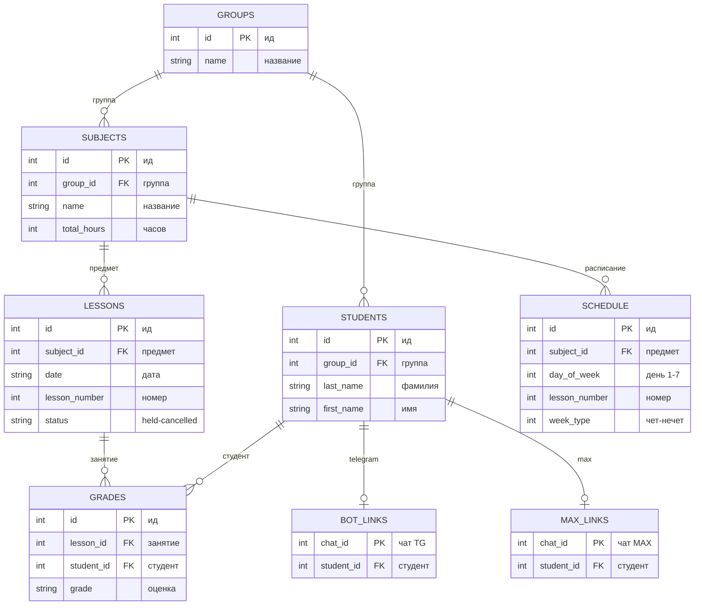
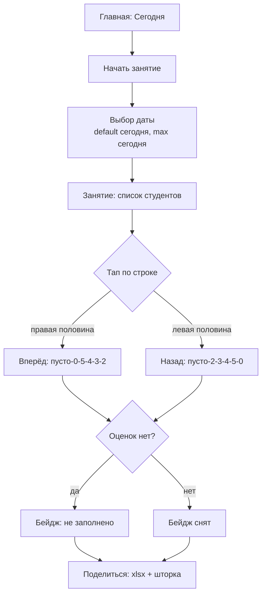
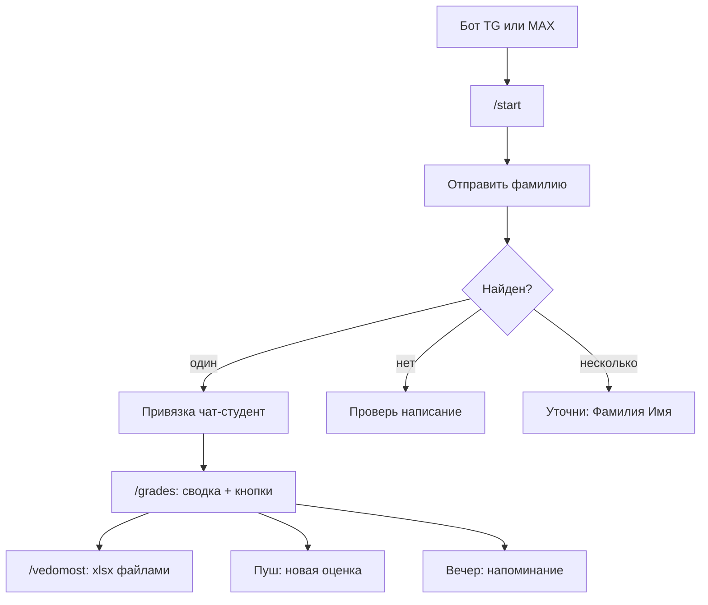
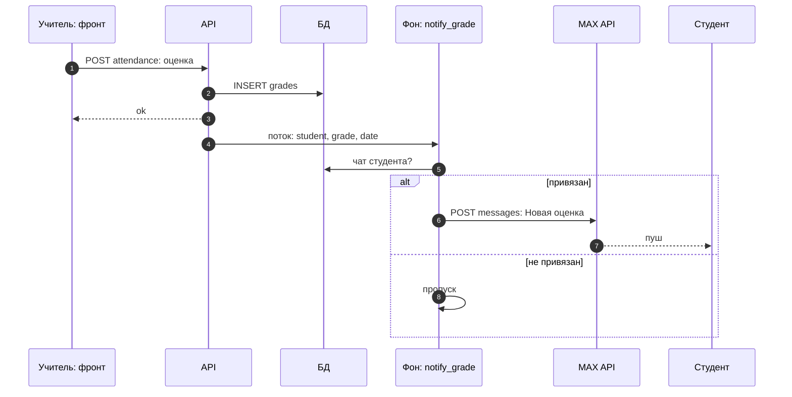
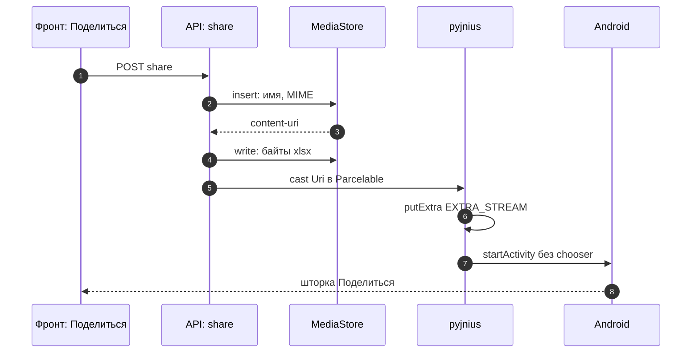
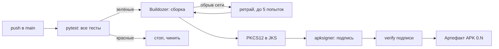

# TeachHelper4 — диаграммы для демонстрации

Все диаграммы — Mermaid, рендерятся прямо на странице GitHub.
Под каждой — ссылка «картинкой» (сервис mermaid.ink) для слайдов презентации.

## 1. Архитектура системы

[Открыть картинкой](https://mermaid.ink/img/eyJjb2RlIjogImZsb3djaGFydCBUQlxuICAgIHN1YmdyYXBoIFRFTFtcItCi0LXQu9C10YTQvtC9XCJdXG4gICAgICAgIFNQQVtcIlNQQTogYXBwLmpzICsgc3R5bGUuY3NzPGJyPldlYlZpZXdcIl1cbiAgICAgICAgTVNbXCJNZWRpYVN0b3JlPGJyPtCX0LDQs9GA0YPQt9C60LhcIl1cbiAgICAgICAgU0hbXCLQqNGC0L7RgNC60LAg0J_QvtC00LXQu9C40YLRjNGB0Y9cIl1cbiAgICBlbmRcbiAgICBzdWJncmFwaCBTUlZbXCLQodC10YDQstC10YA6IEZsYXNrXCJdXG4gICAgICAgIEFQSVtcImFwaS5weTxicj5SRVNUIEFQSVwiXVxuICAgICAgICBEQlsoXCJsZXNzb25zLmRiPGJyPlNRTGl0ZSBXQUxcIildXG4gICAgICAgIEVYUFtcInJlcG9ydF9leHBvcnQucHk8YnI-eGxzeFwiXVxuICAgICAgICBCS1tcItCx0Y3QutCw0L8vcmVzdG9yZTxicj5sZXNzb25zLmRiXCJdXG4gICAgZW5kXG4gICAgc3ViZ3JhcGggQkdbXCLQpNC-0L3QvtCy0YvQtSDQv9C-0YLQvtC60LhcIl1cbiAgICAgICAgVEdbXCJ0Z2JvdC5weTxicj5wb2xsaW5nXCJdXG4gICAgICAgIE1YW1wibWF4Ym90LnB5PGJyPnBvbGxpbmcr0LTQsNC50LTQttC10YHRgtGLK9C60YPRgNCw0YLQvtGA0YtcIl1cbiAgICAgICAgQkNbXCJib3Rjb3JlLnB5PGJyPtC-0LHRidC40Lkg0YLRgNCw0L3RgdC_0L7RgNGCXCJdXG4gICAgZW5kXG4gICAgc3ViZ3JhcGggRVhUW1wi0JLQvdC10YjQvdC40Lkg0LzQuNGAXCJdXG4gICAgICAgIFRHQVtcIlRlbGVncmFtIEFQSVwiXVxuICAgICAgICBNWEFbXCJNQVggQVBJPGJyPnBsYXRmb3JtLWFwaTJcIl1cbiAgICAgICAgU1RbXCLQodGC0YPQtNC10L3RgtGLXCJdXG4gICAgICAgIENVW1wi0JrRg9GA0LDRgtC-0YBcIl1cbiAgICBlbmRcbiAgICBzdWJncmFwaCBDSVtcIkdpdEh1YiBBY3Rpb25zXCJdXG4gICAgICAgIFRTVFtcInB5dGVzdFwiXVxuICAgICAgICBCTERbXCJCdWlsZG96ZXJcIl1cbiAgICAgICAgU0dOW1wiYXBrc2lnbmVyXCJdXG4gICAgZW5kXG4gICAgU1BBIDwtLT4gQVBJXG4gICAgQVBJIDwtLT4gREJcbiAgICBBUEkgLS0-IEVYUFxuICAgIEFQSSAtLT4gQktcbiAgICBCSyAtLT4gTVNcbiAgICBFWFAgLS0-IE1TXG4gICAgTVMgLS0-IFNIXG4gICAgVEcgPC0tPiBUR0FcbiAgICBNWCA8LS0-IE1YQVxuICAgIFRHIC0tLSBCQ1xuICAgIE1YIC0tLSBCQ1xuICAgIFRHQSAtLT4gU1RcbiAgICBNWEEgLS0-IFNUXG4gICAgTVhBIC0tPiBDVVxuICAgIFRTVCAtLT4gQkxEXG4gICAgQkxEIC0tPiBTR05cbiAgICBTR04gLS0-IFNQQSJ9)

**Теория: клиент-сервер.** Интерфейс и данные разделены: SPA общается с бэкендом только через REST API, прямого доступа к базе у фронта нет. SQLite в режиме WAL переживает параллельные чтения. Боты — фоновые daemon-потоки с long-polling: входящие порты и хостинг не нужны. Один и тот же код работает на десктопе и в APK (WebView-обёртка), а сборка и подпись происходят только в CI.

## 2. Схема базы данных

[Открыть картинкой](https://mermaid.ink/img/eyJjb2RlIjogImVyRGlhZ3JhbVxuICAgIEdST1VQUyB8fC0tb3sgU1RVREVOVFMgOiBcItCz0YDRg9C_0L_QsFwiXG4gICAgR1JPVVBTIHx8LS1veyBTVUJKRUNUUyA6IFwi0LPRgNGD0L_Qv9CwXCJcbiAgICBTVUJKRUNUUyB8fC0tb3sgTEVTU09OUyA6IFwi0L_RgNC10LTQvNC10YJcIlxuICAgIFNVQkpFQ1RTIHx8LS1veyBTQ0hFRFVMRSA6IFwi0YDQsNGB0L_QuNGB0LDQvdC40LVcIlxuICAgIExFU1NPTlMgfHwtLW97IEdSQURFUyA6IFwi0LfQsNC90Y_RgtC40LVcIlxuICAgIFNUVURFTlRTIHx8LS1veyBHUkFERVMgOiBcItGB0YLRg9C00LXQvdGCXCJcbiAgICBTVFVERU5UUyB8fC0tb3wgQk9UX0xJTktTIDogXCJ0ZWxlZ3JhbVwiXG4gICAgU1RVREVOVFMgfHwtLW98IE1BWF9MSU5LUyA6IFwibWF4XCJcbiAgICBHUk9VUFMge1xuICAgICAgICBpbnQgaWQgUEsgXCLQuNC0XCJcbiAgICAgICAgc3RyaW5nIG5hbWUgXCLQvdCw0LfQstCw0L3QuNC1XCJcbiAgICB9XG4gICAgU1RVREVOVFMge1xuICAgICAgICBpbnQgaWQgUEsgXCLQuNC0XCJcbiAgICAgICAgaW50IGdyb3VwX2lkIEZLIFwi0LPRgNGD0L_Qv9CwXCJcbiAgICAgICAgc3RyaW5nIGxhc3RfbmFtZSBcItGE0LDQvNC40LvQuNGPXCJcbiAgICAgICAgc3RyaW5nIGZpcnN0X25hbWUgXCLQuNC80Y9cIlxuICAgIH1cbiAgICBTVUJKRUNUUyB7XG4gICAgICAgIGludCBpZCBQSyBcItC40LRcIlxuICAgICAgICBpbnQgZ3JvdXBfaWQgRksgXCLQs9GA0YPQv9C_0LBcIlxuICAgICAgICBzdHJpbmcgbmFtZSBcItC90LDQt9Cy0LDQvdC40LVcIlxuICAgICAgICBpbnQgdG90YWxfaG91cnMgXCLRh9Cw0YHQvtCyXCJcbiAgICB9XG4gICAgU0NIRURVTEUge1xuICAgICAgICBpbnQgaWQgUEsgXCLQuNC0XCJcbiAgICAgICAgaW50IHN1YmplY3RfaWQgRksgXCLQv9GA0LXQtNC80LXRglwiXG4gICAgICAgIGludCBkYXlfb2Zfd2VlayBcItC00LXQvdGMIDEtN1wiXG4gICAgICAgIGludCBsZXNzb25fbnVtYmVyIFwi0L3QvtC80LXRgFwiXG4gICAgICAgIGludCB3ZWVrX3R5cGUgXCLRh9C10YIt0L3QtdGH0LXRglwiXG4gICAgfVxuICAgIExFU1NPTlMge1xuICAgICAgICBpbnQgaWQgUEsgXCLQuNC0XCJcbiAgICAgICAgaW50IHN1YmplY3RfaWQgRksgXCLQv9GA0LXQtNC80LXRglwiXG4gICAgICAgIHN0cmluZyBkYXRlIFwi0LTQsNGC0LBcIlxuICAgICAgICBpbnQgbGVzc29uX251bWJlciBcItC90L7QvNC10YBcIlxuICAgICAgICBzdHJpbmcgc3RhdHVzIFwiaGVsZC1jYW5jZWxsZWRcIlxuICAgIH1cbiAgICBHUkFERVMge1xuICAgICAgICBpbnQgaWQgUEsgXCLQuNC0XCJcbiAgICAgICAgaW50IGxlc3Nvbl9pZCBGSyBcItC30LDQvdGP0YLQuNC1XCJcbiAgICAgICAgaW50IHN0dWRlbnRfaWQgRksgXCLRgdGC0YPQtNC10L3RglwiXG4gICAgICAgIHN0cmluZyBncmFkZSBcItC-0YbQtdC90LrQsFwiXG4gICAgfVxuICAgIEJPVF9MSU5LUyB7XG4gICAgICAgIGludCBjaGF0X2lkIFBLIFwi0YfQsNGCIFRHXCJcbiAgICAgICAgaW50IHN0dWRlbnRfaWQgRksgXCLRgdGC0YPQtNC10L3RglwiXG4gICAgfVxuICAgIE1BWF9MSU5LUyB7XG4gICAgICAgIGludCBjaGF0X2lkIFBLIFwi0YfQsNGCIE1BWFwiXG4gICAgICAgIGludCBzdHVkZW50X2lkIEZLIFwi0YHRgtGD0LTQtdC90YJcIlxuICAgIH0ifQ==)

**Теория: реляционная модель.** Прямоугольник — сущность (таблица), внутри — атрибуты. PK (primary key) однозначно идентифицирует строку; FK (foreign key) — ссылка на чужую PK и гарантия целостности: `ON DELETE CASCADE` означает «удалил студента — его оценки ушли следом». `||--o{` читается «один ко многим»: у одной группы много студентов. Привязки чатов — «один к одному» (`UNIQUE` с обеих сторон).

## 3. Сценарий преподавателя

[Открыть картинкой](https://mermaid.ink/img/eyJjb2RlIjogImZsb3djaGFydCBURFxuICAgIEhbXCLQk9C70LDQstC90LDRjzog0KHQtdCz0L7QtNC90Y9cIl0gLS0-IFRbXCLQndCw0YfQsNGC0Ywg0LfQsNC90Y_RgtC40LVcIl1cbiAgICBUIC0tPiBQW1wi0JLRi9Cx0L7RgCDQtNCw0YLRizxicj5kZWZhdWx0INGB0LXQs9C-0LTQvdGPLCBtYXgg0YHQtdCz0L7QtNC90Y9cIl1cbiAgICBQIC0tPiBMW1wi0JfQsNC90Y_RgtC40LU6INGB0L_QuNGB0L7QuiDRgdGC0YPQtNC10L3RgtC-0LJcIl1cbiAgICBMIC0tPiBSe1wi0KLQsNC_INC_0L4g0YHRgtGA0L7QutC1XCJ9XG4gICAgUiAtLT580L_RgNCw0LLQsNGPINC_0L7Qu9C-0LLQuNC90LB8IEZbXCLQktC_0LXRgNGR0LQ6INC_0YPRgdGC0L4tMC01LTQtMy0yXCJdXG4gICAgUiAtLT580LvQtdCy0LDRjyDQv9C-0LvQvtCy0LjQvdCwfCBCW1wi0J3QsNC30LDQtDog0L_Rg9GB0YLQvi0yLTMtNC01LTBcIl1cbiAgICBGIC0tPiBXe1wi0J7RhtC10L3QvtC6INC90LXRgj9cIn1cbiAgICBCIC0tPiBXXG4gICAgVyAtLT580LTQsHwgQVRUW1wi0JHQtdC50LTQtjog0L3QtSDQt9Cw0L_QvtC70L3QtdC90L5cIl1cbiAgICBXIC0tPnzQvdC10YJ8IE9LW1wi0JHQtdC50LTQtiDRgdC90Y_RglwiXVxuICAgIEFUVCAtLT4gU0hSW1wi0J_QvtC00LXQu9C40YLRjNGB0Y86IHhsc3ggKyDRiNGC0L7RgNC60LBcIl1cbiAgICBPSyAtLT4gU0hSIn0=)

**Теория: ветвление и события.** Ромб — условие, стрелки — переходы: это те же `if/else` и циклы, что в коде, только картинкой. Интерфейс событийный: тап — событие, `cycle()` — обработчик. Координата тапа (левая/правая половина) становится управляющим параметром — так одно и то же действие получает два смысла без лишних кнопок.

## 4. Сценарий студента

[Открыть картинкой](https://mermaid.ink/img/eyJjb2RlIjogImZsb3djaGFydCBURFxuICAgIFNbXCLQkdC-0YIgVEcg0LjQu9C4IE1BWFwiXSAtLT4gQ01EW1wiL3N0YXJ0XCJdXG4gICAgQ01EIC0tPiBGSU9bXCLQntGC0L_RgNCw0LLQuNGC0Ywg0YTQsNC80LjQu9C40Y5cIl1cbiAgICBGSU8gLS0-IEJORHtcItCd0LDQudC00LXQvT9cIn1cbiAgICBCTkQgLS0-fNC-0LTQuNC9fCBZW1wi0J_RgNC40LLRj9C30LrQsCDRh9Cw0YIt0YHRgtGD0LTQtdC90YJcIl1cbiAgICBCTkQgLS0-fNC90LXRgnwgTkZbXCLQn9GA0L7QstC10YDRjCDQvdCw0L_QuNGB0LDQvdC40LVcIl1cbiAgICBCTkQgLS0-fNC90LXRgdC60L7Qu9GM0LrQvnwgTU5bXCLQo9GC0L7Rh9C90Lg6INCk0LDQvNC40LvQuNGPINCY0LzRj1wiXVxuICAgIFkgLS0-IEdbXCIvZ3JhZGVzOiDRgdCy0L7QtNC60LAgKyDQutC90L7Qv9C60LhcIl1cbiAgICBHIC0tPiBWW1wiL3ZlZG9tb3N0OiB4bHN4INGE0LDQudC70LDQvNC4XCJdXG4gICAgRyAtLT4gUFVTSFtcItCf0YPRiDog0L3QvtCy0LDRjyDQvtGG0LXQvdC60LBcIl1cbiAgICBHIC0tPiBFVkVbXCLQktC10YfQtdGAOiDQvdCw0L_QvtC80LjQvdCw0L3QuNC1XCJdIn0=)

**Теория: диалог как конечный автомат.** У бота два состояния — «не привязан» и «привязан», переходы между ними — команды и фамилия. В каждом состоянии понятны только свои команды, остальные получают подсказку. Доступ строго read-only: студент видит только свои оценки. Команды идемпотентны — повторный `/grades` просто показывает сводку заново.

## 5. Оценка доходит до студента (sequence)

[Открыть картинкой](https://mermaid.ink/img/eyJjb2RlIjogInNlcXVlbmNlRGlhZ3JhbVxuICAgIGF1dG9udW1iZXJcbiAgICBwYXJ0aWNpcGFudCBVIGFzINCj0YfQuNGC0LXQu9GMOiDRhNGA0L7QvdGCXG4gICAgcGFydGljaXBhbnQgQSBhcyBBUElcbiAgICBwYXJ0aWNpcGFudCBEIGFzINCR0JRcbiAgICBwYXJ0aWNpcGFudCBGIGFzINCk0L7QvTogbm90aWZ5X2dyYWRlXG4gICAgcGFydGljaXBhbnQgTSBhcyBNQVggQVBJXG4gICAgcGFydGljaXBhbnQgUyBhcyDQodGC0YPQtNC10L3RglxuICAgIFUtPj5BOiBQT1NUIGF0dGVuZGFuY2U6INC-0YbQtdC90LrQsFxuICAgIEEtPj5EOiBJTlNFUlQgZ3JhZGVzXG4gICAgQS0tPj5VOiBva1xuICAgIEEtPj5GOiDQv9C-0YLQvtC6OiBzdHVkZW50LCBncmFkZSwgZGF0ZVxuICAgIEYtPj5EOiDRh9Cw0YIg0YHRgtGD0LTQtdC90YLQsD9cbiAgICBhbHQg0L_RgNC40LLRj9C30LDQvVxuICAgICAgICBGLT4-TTogUE9TVCBtZXNzYWdlczog0J3QvtCy0LDRjyDQvtGG0LXQvdC60LBcbiAgICAgICAgTS0tPj5TOiDQv9GD0YhcbiAgICBlbHNlINC90LUg0L_RgNC40LLRj9C30LDQvVxuICAgICAgICBGLT4-Rjog0L_RgNC-0L_Rg9GB0LpcbiAgICBlbmQifQ==)

**Теория: асинхронность.** HTTP-ответ («ok») уходит сразу, а тяжёлое (уведомление) — потом, в фоновом daemon-потоке: учитель не ждёт сеть. Входящие бот забирает сам через long-polling (альтернатива — webhook, но он требует открытого порта). Доставка best-effort: не привязан — тихо пропускаем, ошибка сети — глотаем, журнал важнее уведомлений.

## 6. Шаринг ведомости (sequence)

[Открыть картинкой](https://mermaid.ink/img/eyJjb2RlIjogInNlcXVlbmNlRGlhZ3JhbVxuICAgIGF1dG9udW1iZXJcbiAgICBwYXJ0aWNpcGFudCBVIGFzINCk0YDQvtC90YI6INCf0L7QtNC10LvQuNGC0YzRgdGPXG4gICAgcGFydGljaXBhbnQgQSBhcyBBUEk6IHNoYXJlXG4gICAgcGFydGljaXBhbnQgTVMgYXMgTWVkaWFTdG9yZVxuICAgIHBhcnRpY2lwYW50IEogYXMgcHlqbml1c1xuICAgIHBhcnRpY2lwYW50IEFOIGFzIEFuZHJvaWRcbiAgICBVLT4-QTogUE9TVCBzaGFyZVxuICAgIEEtPj5NUzogaW5zZXJ0OiDQuNC80Y8sIE1JTUVcbiAgICBNUy0tPj5BOiBjb250ZW50LXVyaVxuICAgIEEtPj5NUzogd3JpdGU6INCx0LDQudGC0YsgeGxzeFxuICAgIEEtPj5KOiBjYXN0IFVyaSDQsiBQYXJjZWxhYmxlXG4gICAgSi0-Pko6IHB1dEV4dHJhIEVYVFJBX1NUUkVBTVxuICAgIEotPj5BTjogc3RhcnRBY3Rpdml0eSDQsdC10LcgY2hvb3NlclxuICAgIEFOLS0-PlU6INGI0YLQvtGA0LrQsCDQn9C-0LTQtdC70LjRgtGM0YHRjyJ9)

**Теория: Intent и JNI-мост.** Intent — декларативный запрос системе («отправь это»), а не прямой вызов: Android сам находит подходящие приложения. С Android 7 нельзя отдавать `file://` — только `content://` из MediaStore (песочница). `Parcelable` + `cast` решают проблему pyjnius: без явного приведения типов JNI-мост не может выбрать нужную перегрузку Java-метода среди одноимённых.

## 7. CI: от пуша до APK (flowchart)

[Открыть картинкой](https://mermaid.ink/img/eyJjb2RlIjogImZsb3djaGFydCBMUlxuICAgIFBbXCJwdXNoINCyIG1haW5cIl0gLS0-IFRbXCJweXRlc3Q6INCy0YHQtSDRgtC10YHRgtGLXCJdXG4gICAgVCAtLT580LfQtdC70ZHQvdGL0LV8IEJbXCJCdWlsZG96ZXI6INGB0LHQvtGA0LrQsFwiXVxuICAgIFQgLS0-fNC60YDQsNGB0L3Ri9C1fCBTVE9QW1wi0YHRgtC-0L8sINGH0LjQvdC40YLRjFwiXVxuICAgIEIgLS0-fNC-0LHRgNGL0LIg0YHQtdGC0Lh8IFJbXCLRgNC10YLRgNCw0LksINC00L4gNSDQv9C-0L_Ri9GC0L7QulwiXVxuICAgIFIgLS0-IEJcbiAgICBCIC0tPiBLW1wiUEtDUzEyINCyIEpLU1wiXVxuICAgIEsgLS0-IFNbXCJhcGtzaWduZXI6INC_0L7QtNC_0LjRgdGMXCJdXG4gICAgUyAtLT4gVltcInZlcmlmeSDQv9C-0LTQv9C40YHQuFwiXVxuICAgIFYgLS0-IEFbXCLQkNGA0YLQtdGE0LDQutGCIEFQSyAwLk5cIl0ifQ==)

**Теория: CI/CD.** Конвейер: каждый пуш проходит ворота качества — красные тесты останавливают всё до починки. Подпись APK доказывает авторство и целостность (без неё Android не обновит приложение). Версия 0.N растёт сама, артефакт — installable APK. Ретраи до 5 попыток страхуют flaky-сеть, а не код.
